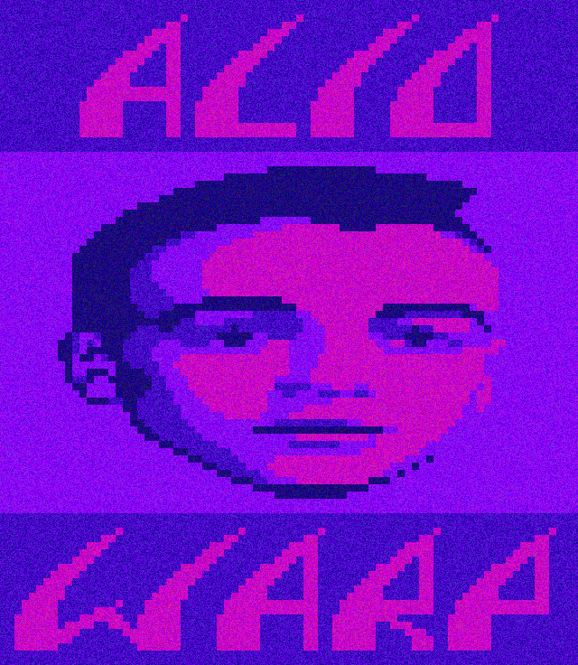

# Acid Warp for Android

- [Google Play Store Link](https://play.google.com/store/apps/details?id=com.dermochelys.acidwarp)
- Supports phones, tablets, and [Android TV](https://www.android.com/tv/) / [Google TV](https://tv.google/) devices running Android 10+.

## Technical Details
- Based on a [fork](https://github.com/Dermochelys/acidwarp) of [dreamlayers/acidwarp](https://github.com/dreamlayers/acidwarp), which is embedded as a [submodule](app/jni).
- See the submodule's [README.md](https://github.com/Dermochelys/acidwarp) for more details.

## Building

- SDL3 is automatically downloaded during the build process based on the version specified in `SDL_VERSION` at the repo root. The Gradle build will download the correct `.aar` file from [SDL releases](https://github.com/libsdl-org/SDL/releases) to [app/libs](app/libs) if it's not already present.
- Build the app by running `./gradlew build`.

Most build dependencies are dynamically loaded, however, you must also ensure that some dependencies are preloaded via `Tools > SDK Manager` in Android Studio, or using [sdkmanager](https://developer.android.com/tools/sdkmanager):
- `cmake` with version matching that inside of [build.gradle](app/build.gradle)
- `Android SDK Tools` with version matching that of `buildToolsVersion`, found in [build.gradle](app/build.gradle)

## Previous ports
- See the `previous_ports` folder inside the [submodule](https://github.com/Dermochelys/acidwarp).
- Original website: https://noah.org/acidwarp/

## License

As this is a descendent of Steven Will's `AcidWarp for Linux` which was GPL licensed, this too
is and must also be GPL licensed.  See [gpl-3.0.md](gpl-3.0.md)

