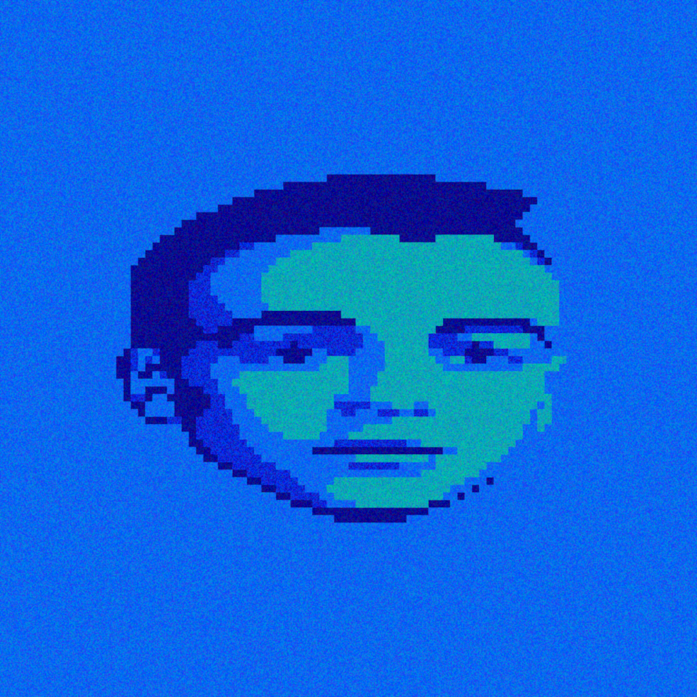

# Acid Warp for iOS / iPadOS

- App Store Link TBD
- Supports devices running iOS / iPadOS 15.6 or later.

## Technical Details
- Based on a [fork](https://github.com/Dermochelys/acidwarp) of [dreamlayers/acidwarp](https://github.com/dreamlayers/acidwarp), which is embedded as a [submodule](app/jni).
- See the submodule's [README.md](https://github.com/Dermochelys/acidwarp) for more details.

## Building

- Use Xcode 26 or later.
- SDL3 is automatically downloaded during the build via a Run Script build phase. The script checks if `SDL3.xcframework` exists in the repo root and downloads it if needed based on the version in `SDL_VERSION`.

## Previous ports
- See the `previous_ports` folder inside the [submodule](https://github.com/Dermochelys/acidwarp).

## License

As this is a descendent of Steven Will's `AcidWarp for Linux` which was GPL licensed, this too
is and must also be GPL licensed.  See [gpl-3.0.md](gpl-3.0.md)

