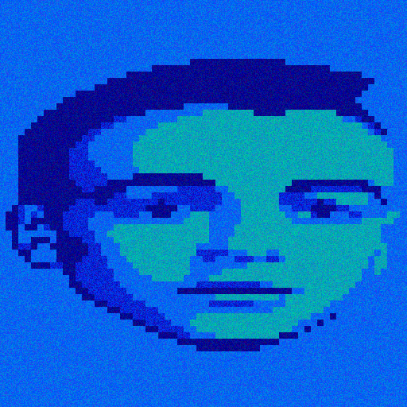

# Acid Warp for macOS

- App Store Link TBD
- Supports devices running macOS 11.5 or later.

## Technical Details
- Based on a [fork](https://github.com/Dermochelys/acidwarp) of [dreamlayers/acidwarp](https://github.com/dreamlayers/acidwarp), which is embedded as a [submodule](acidwarp/acidwarp).
- See the submodule's [README.md](https://github.com/Dermochelys/acidwarp) for more details.

## Building

Xcode 26+ has been used to develop the app.  It may be possible to use older Xcode versions, but that is left as an exercise to those interested.
Version 3 of SDL is required.  

- Download the latest release `.dmg` in [SDL releases](https://github.com/libsdl-org/SDL/releases)
- Follow the SDL instructions in the [macOS README](https://wiki.libsdl.org/SDL3/README-macos) for how to add SDL as a framework to the Xcode project.

## Previous ports
- See the submodule's [README.md](https://github.com/Dermochelys/acidwarp) for more details.

## License

As this is a descendent of Steven Will's `AcidWarp for Linux` which was GPL licensed, this too
is and must also be GPL licensed.  See [gpl-3.0.md](gpl-3.0.md)

