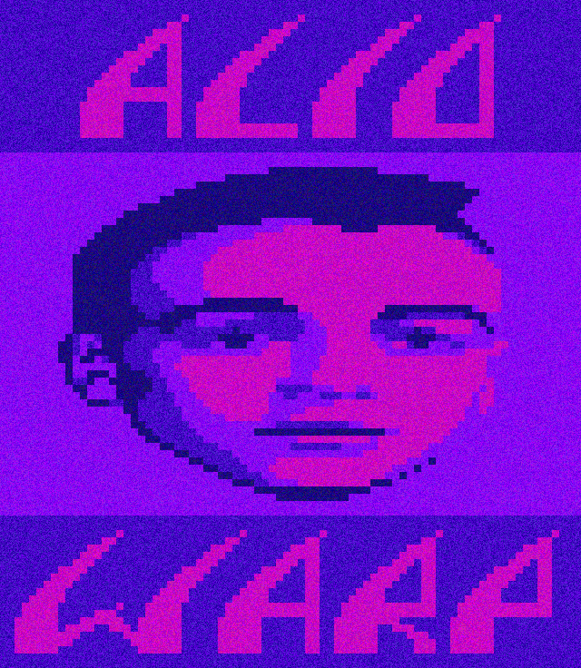

# Acid Warp for macOS

<a href="https://apps.apple.com/us/app/acid-warp/id6753610977?mt=12&itscg=30200&itsct=apps_box_badge&mttnsubad=6753610977" style="display: inline-block;"></a>

Supports devices running macOS 11.5 or later.

## Building

Xcode 26+ has been used to develop the app.  It may be possible to use older Xcode versions, but that is left as an exercise to those interested.

SDL3 and SDL3_image are automatically downloaded during the build via Run Script build phases. The scripts check if `SDL3.xcframework` and `SDL3_image.xcframework` exist in the repo root and download them if needed based on the versions in `SDL_VERSION` and `SDL3_IMAGE_VERSION`.

## App Store Distribution

**Build Number (CFBundleVersion):**

The build number (`CURRENT_PROJECT_VERSION` in Xcode, exposed as `CFBundleVersion` in Info.plist) must be incremented for each App Store submission. Apple requires each new upload to have a higher build number than any previously uploaded build for the same version.

**Location**: `acidwarp-macos.xcodeproj/project.pbxproj` (search for `CURRENT_PROJECT_VERSION`)

**Before uploading to App Store:**
1. Increment the build number in both Debug and Release configurations
2. The build number must be higher than any previous uploads (check App Store Connect for current value)
3. Example: If App Store shows build 6, use 7 or higher for your next upload

**Marketing Version**: The `MARKETING_VERSION` only needs to change when you release a new user-facing version.

## Workaround for SDL_image issue with libjxl

- Starting with iOS 18 and Xcode 16, Apple bundled libjxl (JPEG XL decoder library) into iOS as an internal/private API. When apps are submitted to the App Store, Apple's automated review
  process scans for symbols matching these private APIs and rejects apps that appear to use them - even if the app is using its own bundled version of libjxl rather than calling Apple's
  private APIs.

- The workaround (implemented in build-sdl3-image-xcode.sh:56-125) renames JXL symbols by prefixing them with SDL_ to avoid App Store rejection. Specifically, it renames 8 JXL decoder
  functions:

  - JxlDecoderCreate → SDL_JxlDecoderCreate
  - JxlDecoderDestroy → SDL_JxlDecoderDestroy
  - JxlDecoderGetBasicInfo → SDL_JxlDecoderGetBasicInfo
  - JxlDecoderImageOutBufferSize → SDL_JxlDecoderImageOutBufferSize
  - JxlDecoderProcessInput → SDL_JxlDecoderProcessInput
  - JxlDecoderSetImageOutBuffer → SDL_JxlDecoderSetImageOutBuffer
  - JxlDecoderSetInput → SDL_JxlDecoderSetInput
  - JxlDecoderSubscribeEvents → SDL_JxlDecoderSubscribeEvents

- This is done via C preprocessor macros added during SDL3_image's build process.

## UI Testing

Automated UI tests use XCTest's UI testing framework to verify the app works correctly on macOS.

**Running UI tests:**
```bash
./run-uitests.sh
```

**Test Framework:**
- **Location**: `acidwarp-macosUITests/` (Swift UI tests)
- **Framework**: XCTest with XCUIApplication and XCUIElement APIs
- **Environment**: macOS 14+ (Sonoma or later)

**Key Features:**
- **Native UI Testing**: Uses XCTest's built-in UI automation APIs
- **Hardware Acceleration**: Uses native macOS OpenGL with Metal translation layer
- **Input Simulation**: XCTest's native keyboard and mouse event injection
- **Screenshot Capture**: `XCUIScreen.main.screenshot()` with XCTest attachments API
- **Build/Test Separation**: `build-for-testing` then `test-without-building` for faster iterations
- **Code Signing**: Ad-hoc signing (`codesign --sign -`) applied to test runner

**Screenshot Extraction:**
Screenshots are embedded in `.xcresult` bundles and extracted using:
```bash
../extract-test-screenshots.sh macos ./build ./screenshots
```
This uses `xcresulttool export attachments` and renames files based on xcresult manifest metadata for human-readable names.

CI uploads screenshots (PNG files), xcodebuild logs, and .xcresult bundles as artifacts.

## License

As this is a descendent of Steven Will's `AcidWarp for Linux` which was GPL licensed, this too
is and must also be GPL licensed.  See [gpl-3.0.md](../gpl-3.0.md)


